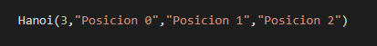

# Readme.md

Durante lo largo de la primera sección del curso de diseño de algoritmos realizamos una variedad de ejercicios prácticos, donde podremos observar su funcionalidad y su uso en el siguiente documento.

## Torres de hanoí

 Torre de Hanoi. Es un juego que consiste en la aplicación de 2, 3, 4, 5, o más discos en una de las tres estacas que se ubican de manera vertical sobre un tablero. El objetivo del juego consiste en trasladar los discos de la primera a la tercera estaca.

Este juego se realizó en un algoritmo donde su resultado es la cantidad de movimientos que se deben realizar para que todos los discos queden en la tercera estaca.

En la ejecución de este ejercicio podremos aumentar o disminuir la cantidad de discos a utilizar solo cambiando el numero que aparece en la anterior linea de codigo.

## Busqueda binaria 

## Busqueda binaira recursiva 

La búsqueda binaria es un eficiente algoritmo para poder buscar un elemento específico dentro de una lista ordenada, este algoritmo funciona al dividir la lista en dos sublistas donde esto lo hace en repetidas veces hasta que encuentra la ubicación posible donde se encuentre.

## Metodos de Ordenamientos 

Para saber más sobre los tres diferentes metodos de ordenamiento que se encuentra entra a[ métodos](https://docs.google.com/document/d/1C0SSsjw4EG98UcNvAg_VX9INFOgLeptRCRRDbcmVBpc/edit), donde te direccionara un archivo donde se te mostrará ejecuciones, explicación de su rendimiento y su comparación entre ellos mismos.

## Observaciones

1. Todos los ejercicios están creados en Python
2. su ejecución debe de ser por visual studio code, ATOM, IDE Python o por Python online \( no se recomiendo ejecutar los métodos de ordenamiento por Python online por él gran cantidad de uso de datos\)
3. Atender a cada una de los cambios que se pueden realizar dentro de cada algoritmo.

